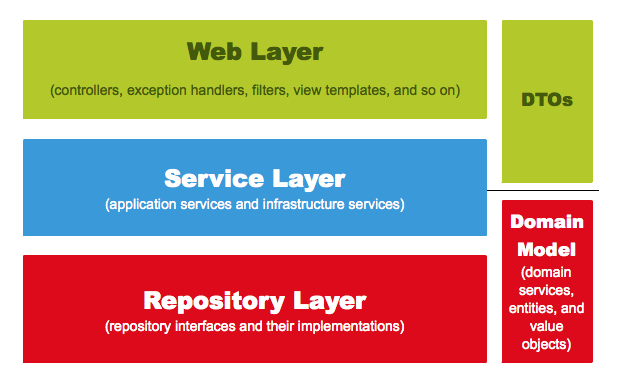

# springboot2-webservice

## Spring 웹 계층

----------------------------------------------
> `Web Layer (controllers, exception handlers, filters, view templates, and so on)`  
> - 흔히 사용하는 컨트롤러(@Controller)와 JSP/Freemarker 등의 뷰 템플릿 영역
> - 이외에도 필터(@Filter), 인터셉터, 컨트롤러 어드바이스(@ControllerAdvice) 등 외부 요청과 응답에 대한 전반적인 영역

> ` Service Layer (application services and infrastructure services) `
> - @Service에 사용되는 서비스 영역.
> - 일반적으로 Controller와 Dao의 중간 영역에서 사용된다.
> - @Transactional이 사용되어야 하는 영역.

> `Repository Layer`
> - Database와 같이 데이터 저장소에 접근하는 영역
> - 기존의 Dao(Data Access Object) 영역으로 이해하면 쉽다.

> `Dtos`
> - Dto(Data Transfer Object)는 계층 간에 데이터 교환을 위한 객체를 이야기하며 Dtos는 이들의 영역을 얘기한다.
> - 예를 들어 뷰 템플릿 엔진에서 사용될 객체나 Repository Layer에서 결과로 넘겨준 객체 등이 이들을 이야기한다.

> `Domain Model (Domain services, entities, and value objects)`
> - 도메인이라 불리는 개발 대상을 모든 사람이 동일한 관점에서 이해할 수 있고 공유할 수 있도록 단순화 시킨것이 도메인 모델이라고 한다.
> - 예를들면 택시 앱이라고 하면 배차,탑승,요금 등이 모두 도메인이 될 수 있다.
> - @Entity가 사용된 영역 역시 도메인 모델이라고 이해 하면 된다.
> - 다만, 무조건 데이터베이스의 테이블과 관계가 있어야만 하는 것은 아니다.
> - VO처럼 값 객체들도 이 영역에 해당하기 때문이다.
